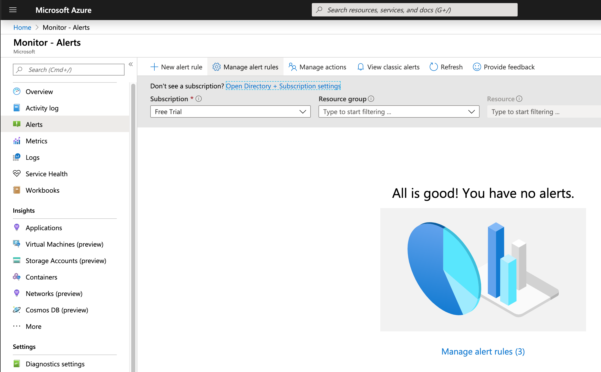
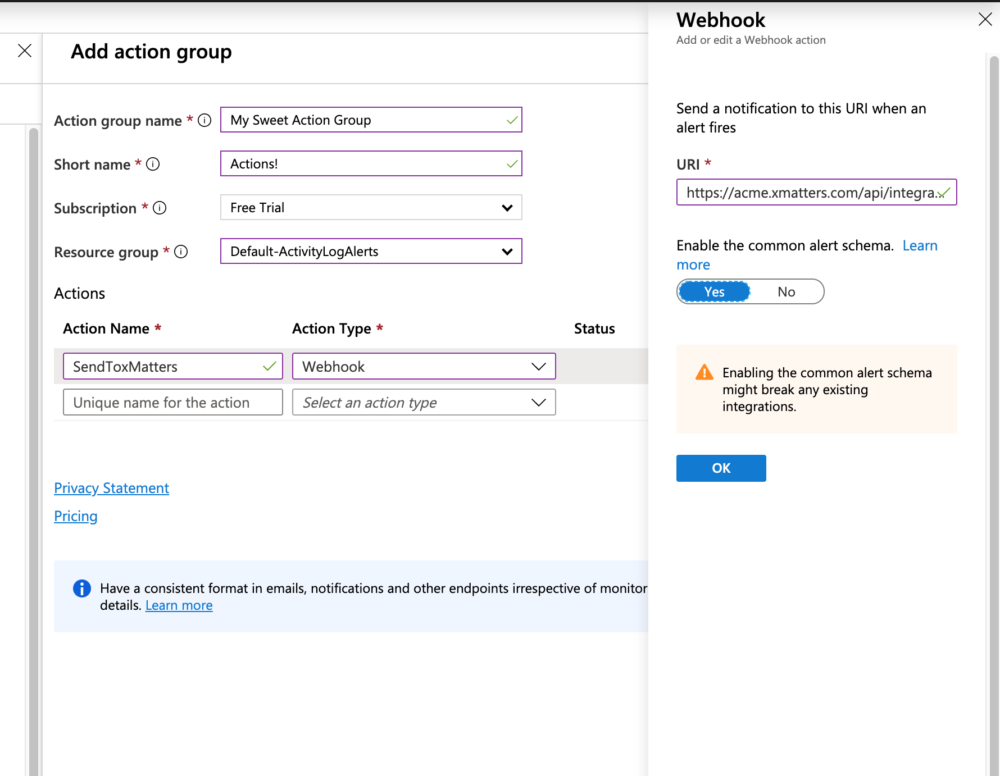

# Azure
Microsoft Azure is a cloud computing service created by Microsoft for building, testing, deploying, and managing applications and services through Microsoft-managed data centers. This integration adds the power of the xMatters platform to Azure Monitoring. 

<kbd>
  
</kbd>

# Pre-Requisites
* [Azure account](https://azure.microsoft.com/en-us/)
* xMatters account - If you don't have one, [get one](https://www.xmatters.com)!

# Files
* [AzureMonitor.zip](AzureMonitor.zip) - The workflow zip for Azure Monitoring.


# How it works
When a Monitoring Alert is triggered, the xMatters Action fires to the Flow Designer HTTP Trigger which triggers the flow. The flow inspects the **Monitor Condition** field of the alert. If the field is "Resolved", the flow branches and retrieves the Active events with a matching `ID` field in the Get Events step and then terminates any events found. If the **Monitor Condition** is any other value, a new event is generated targeting the recipients defined in the **Create xMatters Event** step. 

# Installation


## xMatters set up
1. Login to xMatters, navigate to the Workflow tab and import the [AzureMonitor.zip](AzureMonitor.zip) workflow. Details [here](https://help.xmatters.com/ondemand/xmodwelcome/workflows/manage-workflows.htm#ImportExport)
2. Click on the **Azure Monitor** workflow and then click the Flows tab. Click on the **Integrated Alert** canvas and then double click the **Integrated Alert - Azure Monitor Inbound** HTTP inbound step. 
3. Copy the URL and keep for future reference. 


## Azure Monitoring set up
1. Login to the Azure Portal and navigate to the Monitoring Service. 
2. Click on the Manage Alert Rules:

<kbd>
  
</kbd>

3. Create a new Alert Rule with the appropriate metric to alert on. In the Actions section, if you do not have an action group created, create a new one with the appropriate values. Then add a new Action with a name indicating xMatters. Select an Action Type of **Webhook** and paste in the integration url from above. Also make sure to set the **common alert schema** switch to Yes. 

**Note** if you would like to set the recipients here, you can append `&recipients=MY_AWESOME_RECIPIENT`. For example:

```
https://acme.xmatters.com/api/integration/1/functions/UUID-GOES-HERE/triggers?apiKey=API-KEY-GOES-HERE&recipients=MY_AWESOME_RECIPIENT
```
Alternatively, recipients can be defined using [Subscriptions](https://help.xmatters.com/ondemand/userguide/receivingalerts/subscriptions/howtousesubscriptions.htm)

<kbd>
	
</kbd>

4. Complete saving the Alert Rule by clicking Ok a million times. 

# Testing
Testing will depend on the criteria used for the Alert Rule, so do what needs to happen to trigger the rule. When the alert shows as firing, the webhook will be triggered and a new event will be created targeting the recipients. 


# Troubleshooting
The first place to check is the Alerts section in the Monitoring service. If the alert has not fired the xMatters integration will not be triggered. 

If the Alert has fired in Azure Monitoring, the next place to check is the Activity stream in Flow Designer. After logging in to xMatters, navigate to the **Workflows** tab, then the **Azure Monitor** workflow and on the flows tab, click the **Integrated Alert** canvas. From there click the Activity Stream in the upper right corner. Verify the new entries there. If they do not correspond to the Alert just fired, then Azure is not communicating with xMatters properly, so check the Action in the Action Group for the Alert Rule. 
If the entry is in the Activity Stream, then read the log tab for any errors. If none are found, navigate to the **Reports** tab and see if there is a new event. If the event is there, but you were not notified, verify the `recipients` portion of the event properties. 


